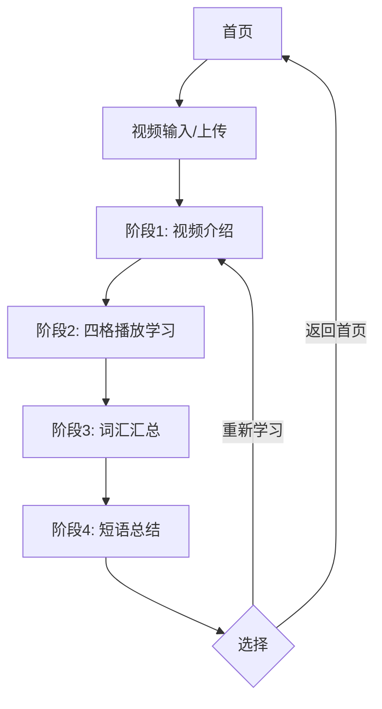

## 1. 产品概述
一个智能视频学习工具，支持用户通过URL或上传视频文件，实现边看边学的沉浸式英语学习体验。通过四阶段学习流程，帮助用户提升英语听力和词汇能力。

- 解决用户英语学习中的听力和词汇积累问题
- 面向英语学习者和需要提升专业英语的用户
- 通过视频内容提取和智能分析，提供个性化学习体验

## 2. 核心功能

### 2.1 用户角色
| 角色 | 注册方式 | 核心权限 |
|------|----------|----------|
| 普通用户 | 邮箱注册 | 上传/输入视频、观看学习、查看词汇总结 |
| 高级用户 | 付费升级 | 无限制使用、导出学习记录、高级分析功能 |

### 2.2 功能模块
本产品包含以下主要页面：
1. **首页**: 视频输入、上传功能、学习历史
2. **学习页面**: 四阶段学习流程（介绍、播放学习、词汇总结、短语总结）
3. **个人中心**: 学习记录、收藏词汇、设置

### 2.3 页面详情
| 页面名称 | 模块名称 | 功能描述 |
|----------|----------|----------|
| 首页 | 视频输入区 | 输入YouTube/B站URL或上传本地视频文件，支持格式验证 |
| 首页 | 学习历史 | 显示最近学习记录，包含进度和完成时间 |
| 学习页面 | 阶段1-视频介绍 | 显示视频封面、标题、时长，点击开始播放 |
| 学习页面 | 阶段2-四格播放 | 左上角播放视频，左下角显示重点词汇，右上角英文字幕，右下角中文翻译 |
| 学习页面 | 阶段3-词汇汇总 | 显示所有提取的词汇，包含音标、词性、中文释义 |
| 学习页面 | 阶段4-短语总结 | 显示重要短语和习语，包含含义和用法说明 |
| 个人中心 | 学习统计 | 显示学习时长、词汇掌握数量、学习天数 |
| 个人中心 | 收藏词汇 | 管理收藏的重要词汇，支持复习功能 |

## 3. 核心流程

### 普通用户学习流程
1. 用户进入首页，选择输入视频URL或上传视频文件
2. 系统处理视频，提取音频和字幕信息
3. 进入阶段1：查看视频介绍信息，点击开始播放
4. 进入阶段2：四格布局同时显示视频、词汇、双语字幕
5. 播放完成后自动进入阶段3：查看词汇汇总
6. 进入阶段4：查看短语和表达总结
7. 可选择重新开始或返回首页

## 4. 用户界面设计

### 4.1 设计风格
- **主色调**: 深蓝色 (#1e3a8a) 作为导航栏，白色背景
- **按钮样式**: 圆角矩形，主要操作为蓝色，次要操作为灰色
- **字体**: 英文字体使用Arial，中文使用思源黑体
- **布局风格**: 卡片式布局，重要内容使用半透明黑色遮罩
- **图标风格**: 使用简洁的线性图标，主要操作用蓝色填充

### 4.2 页面设计概述
| 页面名称 | 模块名称 | UI元素 |
|----------|----------|----------|
| 首页 | 视频输入区 | 大输入框居中，支持拖拽上传，蓝色开始按钮 |
| 学习页面 | 阶段1介绍 | 视频封面占主要区域，标题和描述文字叠加在底部 |
| 学习页面 | 阶段2四格 | 2x2网格布局，每格有边框区分，视频区域最大 |
| 学习页面 | 阶段3词汇 | 两列卡片布局，每个词汇项包含音标和释义 |
| 学习页面 | 阶段4短语 | 三列表格，短语用青色高亮，详细说明 |

### 4.3 响应式设计
- 桌面端优先设计，最小宽度1200px
- 平板端自适应，四格布局调整为上下排列
- 移动端简化显示，重点突出视频和字幕区域

### 4.4 视频播放优化
- 支持倍速播放（0.5x-2x）
- 字幕同步显示，支持开关
- 词汇高亮显示，鼠标悬停显示详细解释
- 支持全屏播放模式