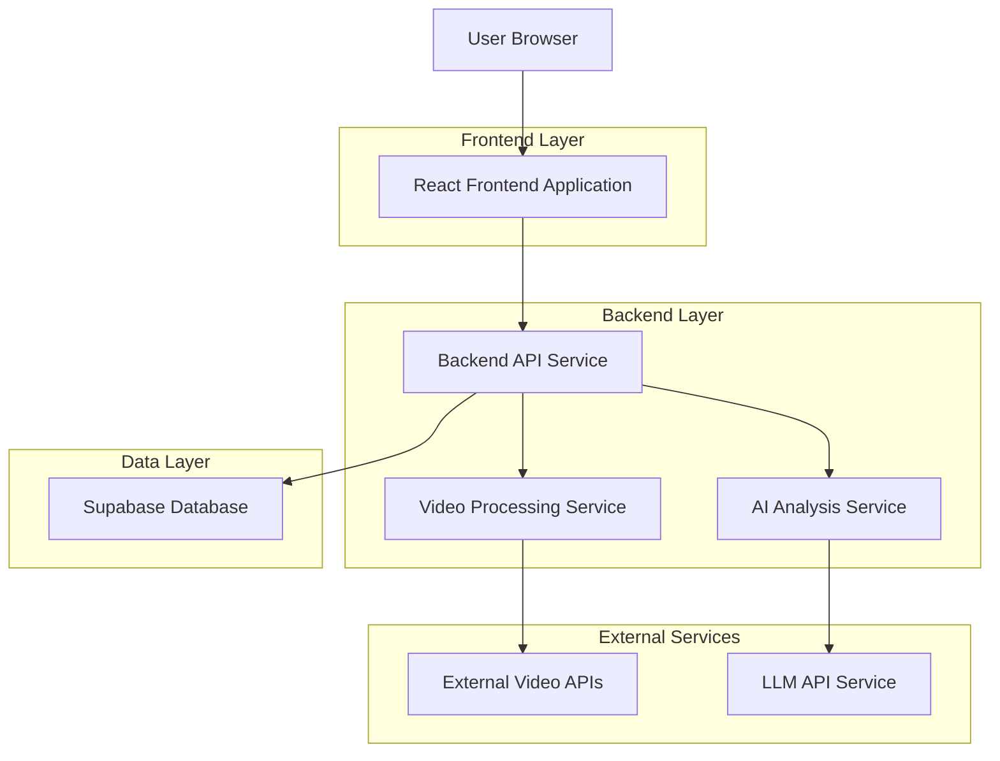
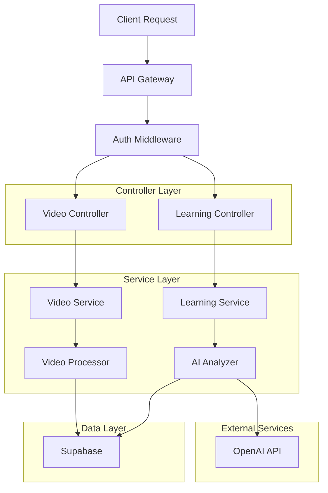
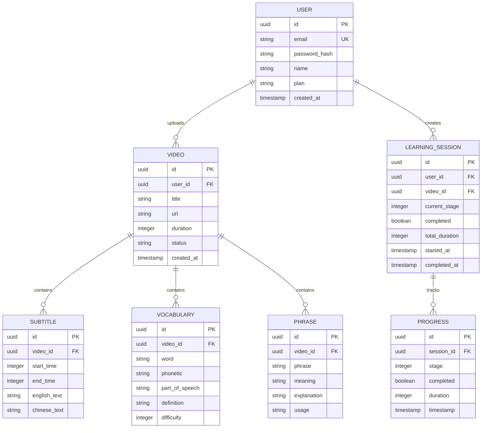

## 1. 架构设计



## 2. 技术栈描述

- **前端**: React@18 + TypeScript + TailwindCSS@3 + Vite
- **初始化工具**: vite-init
- **后端**: Node.js@20 + Express@4
- **数据库**: Supabase (PostgreSQL)
- **视频处理**: FFmpeg + youtube-dl
- **AI分析**: OpenAI GPT API
- **部署**: Docker + Nginx

## 3. 路由定义

| 路由 | 用途 |
|-------|---------|
| / | 首页，视频输入和学习历史 |
| /learn/:videoId | 学习页面，四阶段学习流程 |
| /profile | 个人中心，学习统计和收藏 |
| /api/auth/* | 用户认证相关API |
| /api/video/* | 视频处理相关API |
| /api/learning/* | 学习记录相关API |

## 4. API定义

### 4.1 视频处理API

```
POST /api/video/process
```

请求:
| 参数名 | 参数类型 | 是否必需 | 描述 |
|-----------|-------------|-------------|-------------|
| url | string | 否 | 视频URL（YouTube/B站） |
| file | file | 否 | 上传的视频文件 |
| title | string | 是 | 视频标题 |

响应:
| 参数名 | 参数类型 | 描述 |
|-----------|-------------|-------------|
| videoId | string | 视频唯一ID |
| status | string | 处理状态 |
| duration | number | 视频时长（秒） |

### 4.2 学习数据获取API

```
GET /api/learning/content/:videoId
```

响应:
| 参数名 | 参数类型 | 描述 |
|-----------|-------------|-------------|
| subtitles | array | 字幕数据（时间戳、英文、中文） |
| vocabulary | array | 词汇列表（单词、音标、释义） |
| phrases | array | 短语列表（短语、含义、说明） |
| insights | array | 知识点说明 |

### 4.3 学习记录API

```
POST /api/learning/progress
```

请求:
| 参数名 | 参数类型 | 是否必需 | 描述 |
|-----------|-------------|-------------|-------------|
| videoId | string | 是 | 视频ID |
| stage | number | 是 | 学习阶段（1-4） |
| completed | boolean | 是 | 是否完成 |
| duration | number | 是 | 学习时长（秒） |

## 5. 服务端架构



## 6. 数据模型

### 6.1 实体关系图



### 6.2 数据定义语言

用户表 (users)
```sql
CREATE TABLE users (
    id UUID PRIMARY KEY DEFAULT gen_random_uuid(),
    email VARCHAR(255) UNIQUE NOT NULL,
    password_hash VARCHAR(255) NOT NULL,
    name VARCHAR(100) NOT NULL,
    plan VARCHAR(20) DEFAULT 'free' CHECK (plan IN ('free', 'premium')),
    created_at TIMESTAMP WITH TIME ZONE DEFAULT NOW(),
    updated_at TIMESTAMP WITH TIME ZONE DEFAULT NOW()
);

-- 权限设置
GRANT SELECT ON users TO anon;
GRANT ALL PRIVILEGES ON users TO authenticated;
```

视频表 (videos)
```sql
CREATE TABLE videos (
    id UUID PRIMARY KEY DEFAULT gen_random_uuid(),
    user_id UUID REFERENCES users(id),
    title VARCHAR(500) NOT NULL,
    url VARCHAR(1000),
    file_path VARCHAR(1000),
    duration INTEGER,
    status VARCHAR(50) DEFAULT 'processing',
    created_at TIMESTAMP WITH TIME ZONE DEFAULT NOW()
);

-- 权限设置
GRANT SELECT ON videos TO anon;
GRANT ALL PRIVILEGES ON videos TO authenticated;
```

字幕表 (subtitles)
```sql
CREATE TABLE subtitles (
    id UUID PRIMARY KEY DEFAULT gen_random_uuid(),
    video_id UUID REFERENCES videos(id),
    start_time INTEGER NOT NULL,
    end_time INTEGER NOT NULL,
    english_text TEXT NOT NULL,
    chinese_text TEXT,
    sequence INTEGER NOT NULL
);

-- 权限设置
GRANT SELECT ON subtitles TO anon;
GRANT ALL PRIVILEGES ON subtitles TO authenticated;
```

词汇表 (vocabulary)
```sql
CREATE TABLE vocabulary (
    id UUID PRIMARY KEY DEFAULT gen_random_uuid(),
    video_id UUID REFERENCES videos(id),
    word VARCHAR(100) NOT NULL,
    phonetic VARCHAR(200),
    part_of_speech VARCHAR(20),
    definition TEXT NOT NULL,
    difficulty INTEGER DEFAULT 1,
    created_at TIMESTAMP WITH TIME ZONE DEFAULT NOW()
);

-- 权限设置
GRANT SELECT ON vocabulary TO anon;
GRANT ALL PRIVILEGES ON vocabulary TO authenticated;
```

学习会话表 (learning_sessions)
```sql
CREATE TABLE learning_sessions (
    id UUID PRIMARY KEY DEFAULT gen_random_uuid(),
    user_id UUID REFERENCES users(id),
    video_id UUID REFERENCES videos(id),
    current_stage INTEGER DEFAULT 1,
    completed BOOLEAN DEFAULT FALSE,
    total_duration INTEGER DEFAULT 0,
    started_at TIMESTAMP WITH TIME ZONE DEFAULT NOW(),
    completed_at TIMESTAMP WITH TIME ZONE
);

-- 权限设置
GRANT SELECT ON learning_sessions TO anon;
GRANT ALL PRIVILEGES ON learning_sessions TO authenticated;
```